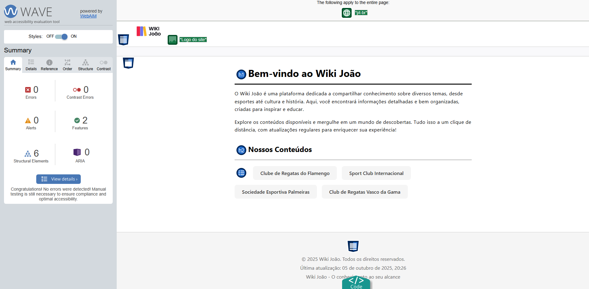
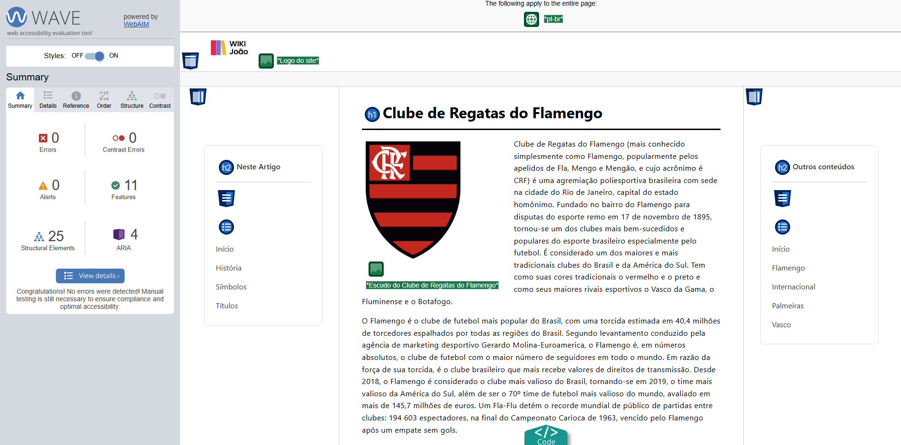
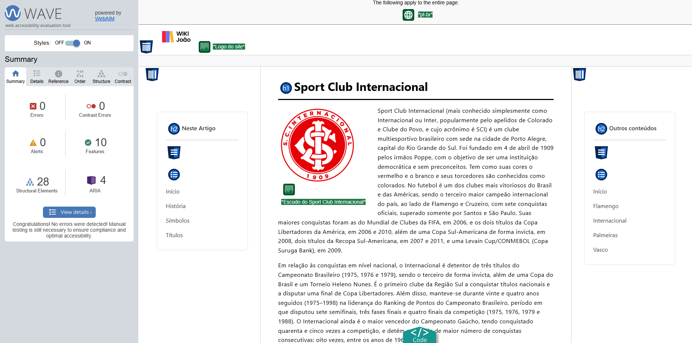
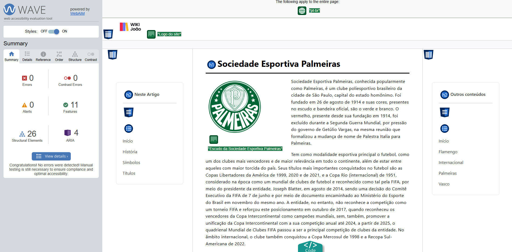
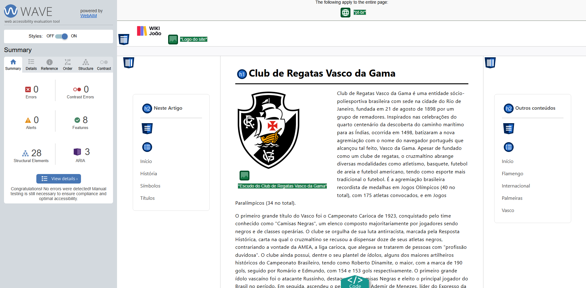

# Módulo 3 - Trilha HTML: Recriando Wikipedia com um Layout Melhor    

## Descrição  
Este projeto tem como objetivo criar um site inspirado na Wikipedia, com um layout mais organizado e esteticamente agradável, aplicando os conceitos de estruturação, semântica e acessibilidade aprendidos no Módulo 3 da Trilha HTML. O foco foi recriar uma experiência de navegação informativa, utilizando uma estrutura básica pré-montada com CSS inicial, que customizei para atender aos requisitos do desafio.    

O site inclui as seguintes seções principais:  
- **Página Principal**: logo no header e uma descrição geral do "Wiki João", apresentando os conteúdos disponíveis.  
- **Páginas de Times**: páginas individuais (ex.: Flamengo, Internacional, Palmeiras, Vasco) com escudos, textos sobre história e tabelas de conquistas.  
- **Navegação**: menu lateral e anchors para facilitar a acessibilidade entre seções.
- **Rodapé**: direitos autorais e links úteis.    

## Instruções  
Todas as páginas compartilham uma **estrutura padrão** (Header, Main com Article e Sidebar, Footer). Parti de um **template em HTML e CSS** fornecido pelo desafio a ser seguido e fiz **customizações** baseadas nos meus conhecimentos para melhorar a semântica (usando tags como `<main>`, `<aside>`, `<section>`), aplicar um design responsivo e otimizar a acessibilidade.  

O desafio pedia um cuidado com a acessbilidade, então durante o desenvolvimento, também utilizei a extensão [WAVE Evaluation Tool](https://wave.webaim.org/extension/) para verificar contrastes, headings, landmarks e garantir boas práticas de acessibilidade.  

📖 Instruções completas do desafio estão disponíveis [neste link](https://github.com/digitalinnovationone/trilha-html-modulo-3).    

## Visualização  
**Demonstração do projeto**:  

**Página Principal**:  

    

**Modelo da página**:  

    

**Acessibilidades**:  

 

 

 

 