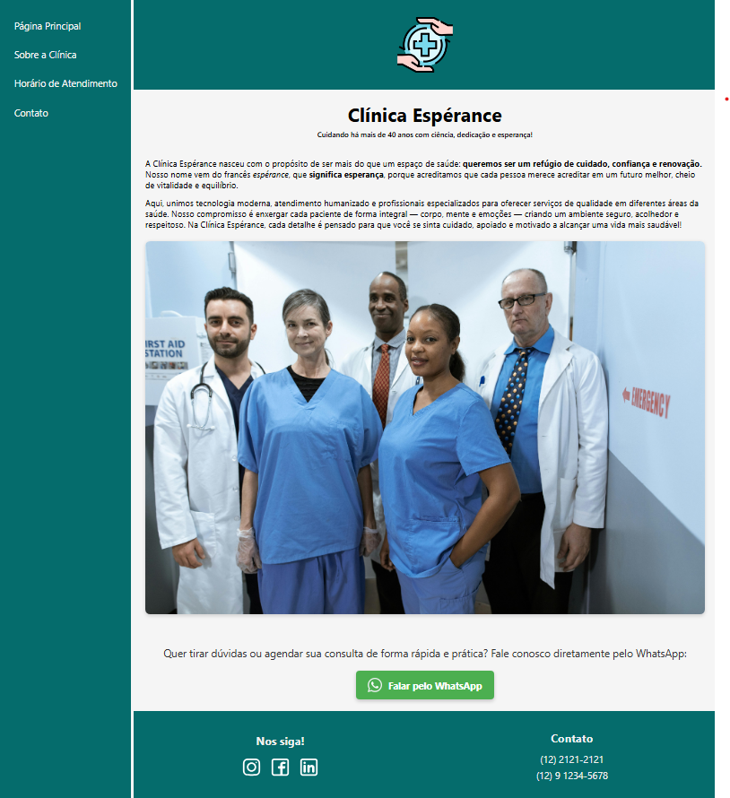
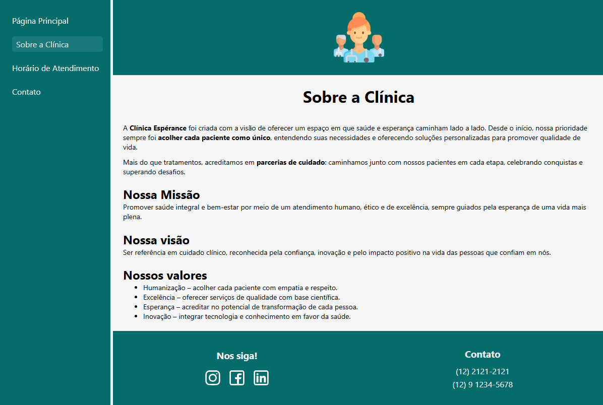
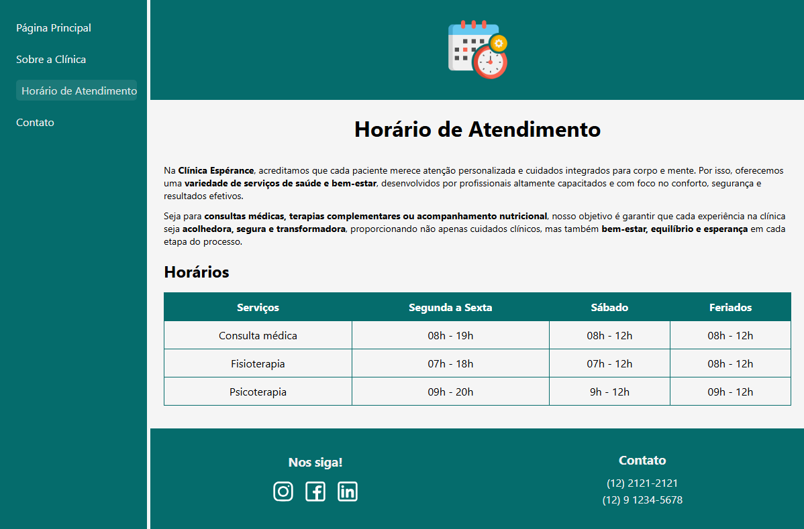
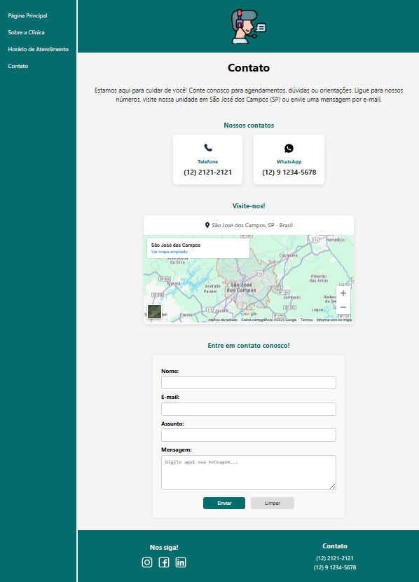

# Desafio 02 - Site "quase" completo em HTML e CSS 

## Descrição
Este desafio tem como objetivo, criar um site "quase" completo, com tudo que foi visto no módulo do curso. Os temas que deverão ser abordados são: Formulários, Estruturação e formatação de texto, Mídias, Tabelas e outros recursos.

## Instruções
O site deve conter as seguintes páginas:
- **Página Principal**: imagem no header e uma breve descrição da clínica.  
- **Sobre a Clínica**: imagem diferente no header e um texto sobre a história e valores.  
- **Horário de Atendimento**: imagem diferente no header, texto introdutório e uma tabela com serviços e horários.  
- **Contato**: imagem diferente no header, telefones, endereço, mapa com Google Maps e formulário de contato (nome, e-mail, assunto, mensagem, botões enviar/limpar).  

Todas as páginas compartilham a mesma **estrutura padrão** (Menu, Header, Content, Footer).  

O desafio disponibilizou um **template em HTML e CSS** como ponto de partida.  
A partir dele, fiz **customizações baseadas nos meus conhecimentos** para padronizar o layout, melhorar a semântica e aplicar boas práticas de CSS.  

📖 Instruções completas estão disponíveis [neste link](https://github.com/digitalinnovationone/trilha-html-modulo-2/blob/main/README.md#instru%C3%A7%C3%B5es).

## Visualização
**Página Principal**:

**Sobre a Clínica**:

**Horário de Atendimento**:

**Contato**:
