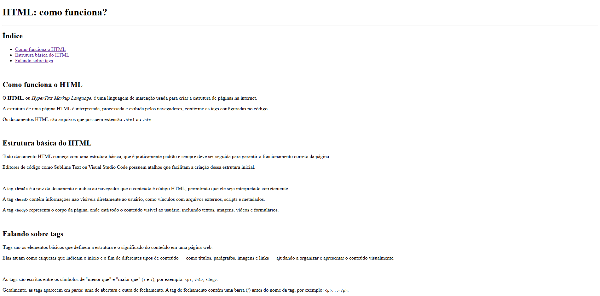

# Desafio 01 - Página Web Básica em HTML

## Descrição

Neste desafio, foi elaborado um website simples utilizando as tags HTML aprendidas durante as aulas. O objetivo é demonstrar conhecimento na estrutura básica de um documento HTML, uso correto das tags textuais, listas e links internos.

## Visualização
